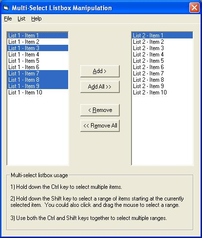



## Simple Multi\-select Listbox Manipulation

### Description

I am just a beginner myself, and this is my first submission, so don't bother voting for this unless it really helped you. It's just a tutorial (if you will) of how to move multiple items from one listbox to another. Basically, I am a newbie, helping other newbies. Eventually, I plan on making this into a custom control or something that I can use in future applications, but I'm not ready to attack that yet. I tried putting as much comments as I could, so I hope that this helps atleast 1 person.

Note: You'll notice that the code for the Add and Remove procedures are identical, other than the listbox names, so in a real world scenario, you'd probably only have one procedure for both, with 2 parameters, (fromList, toList).
 
### More Info
 

             |
---                |---
**Submitted On**   |2004-10-06 09:04:18
**By**             |[Eric Harris](https://github.com/Planet-Source-Code/PSCIndex/blob/master/ByAuthor/eric-harris.md)
**Level**          |Beginner
**User Rating**    |5.0 (10 globes from 2 users)
**Compatibility**  |VB 5\.0, VB 6\.0
**Category**       |[Miscellaneous](https://github.com/Planet-Source-Code/PSCIndex/blob/master/ByCategory/miscellaneous__1-1.md)
**World**          |[Visual Basic](https://github.com/Planet-Source-Code/PSCIndex/blob/master/ByWorld/visual-basic.md)
**Archive File**   |[Simple\_Mul1801821062004\.zip](https://github.com/Planet-Source-Code/eric-harris-simple-multi-select-listbox-manipulation__1-56564/archive/master.zip)

